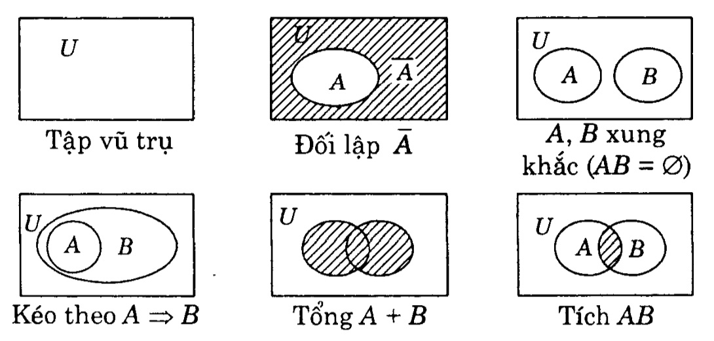
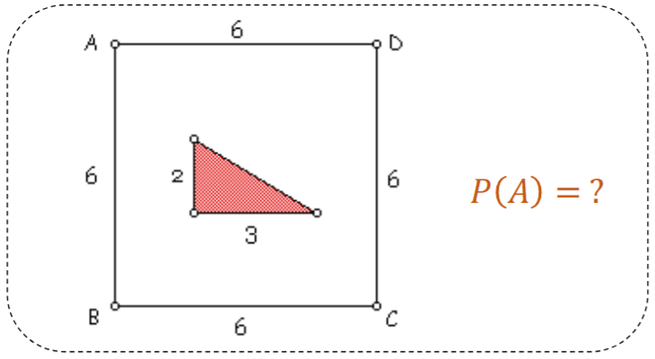

# Các khái niệm cơ bản trong xác suất thống kê

## Xác suất và những khái niệm xoay quanh xác suất

> Xác suất mô tả khả năng xảy ra của một sự kiện trong một phép thử.
- Ký hiệu: P(A).
- Đặc điểm: 0 <= P(A) <= 1.

| Khái niệm | Ý nghĩa | Ví dụ | Ký hiệu
| --- | --- | --- | --- |
| Phép thử (Experiment) | Một hành động được thực hiện mà không thể biết trước chắc chắn kết quả, nhưng có thể xác định được tập hợp tất cả các kết quả có thể xảy ra. | Tung một xúc xắc | E 
| Không gian mẫu (Sample Space) | Tập hợp tất cả các kết cục có thể xảy ra của một phép thử. | Ra mặt {1, 2, 3,... 6} chấm | Ω (Omega)/ S.
| Kết cục (Outcome) | Một kết quả đơn lẻ, cụ thể của phép thử - là một phần tử của không gian mẫu. Còn gọi là biến cố sơ cấp (elementary event). | Xuất hiện mặt 4 chấm. | ω (omega thường), hoặc kᵢ. Ta viết ω ∈ Ω.
| Biến cố / Sự kiện (Event) | Một tập hợp con của không gian mẫu, gồm một hoặc nhiều kết cục thỏa mãn một điều kiện nào đó. | A = "xuất hiện mặt chẵn" → A = {2, 4, 6} ⊂ Ω. | Chữ viết hoa (A, B, C,...)

- Có 5 loại biến cố:
    - Biến cố chắc chắn (U): luôn xảy ra, bằng cả không gian mẫu.
    - Biến cố không thể (V): không bao giờ xảy ra.
    - Biến cố đối lập: biến cố "không xảy ra A".
    - Biến cố xung khắc: 2 biến cố không thể đồng thời xảy ra, tức AB = V.
    - Biến cố ngẫu nhiên: có thể xảy ra hoặc không.

<figure>
  
  <figcaption>Mối quan hệ giữa các khái niệm</figcaption>
</figure>

> Không gian mẫu >= Biến cố >= Kết cục.

## Phép toán trong xác suất

- Tổng 2 sự kiện: A + B => sự kiện xuất hiện ít nhất trong một trong hai sự kiện trên.
- Tích 2 sự kiện: A.B => sự kiện xuất hiện đồng thời trong cả hai sự kiện trên.
- Đối lập của sự kiện A là $\overline{A}$ => sự kiện không xuất hiện trong A.
- Xung khắc: hai sự kiện A và B xung khắc khi chúng không thể đồng thời xảy ra, tức AB = V.
- Kéo theo: sự kiện A dẫn tới sự kiện B (A=>B).
- Tương đương: nếu xuất hiện A thì xuất hiện B và ngược lại (A=B).
- Hiệu 2 sự kiện: A - B => sự kiện xuất hiện ở A nhưng không xuất hiện ở B (A\B).

<figure>
  
  <figcaption>Minh họa các phép toán giữa các sự kiện</figcaption>
</figure>

## Các loại xác suất

- Xác suất cổ điển: P(A) = số kết quả thuận lợi / tổng số kết quả có thể.

- Xác suất hình học: dùng khi biến liên tục, tính theo tỉ lệ "độ đo miền".

Khi biến ngẫu nhiên là liên tục, tức có khả năng nhận vô số giá trị trong một khoảng nào đó, ta không thể đếm được số kết cục nữa => chuyển sang "đo". 

Giả sử trong hình trên, ta muốn tính xác suất một điểm trong hình chữ nhật ABCD thuộc tam giác con, thì sẽ lấy diện tích tam giác chia cho diện tích chữ nhật. 

- Xác suất thực nghiệm: dựa trên số lần xảy ra thực tế/ tổng số lần thử. Càng thực nghiệm nhiều thì xác suất thực nghiệm càng gần xác suất cổ điển.
