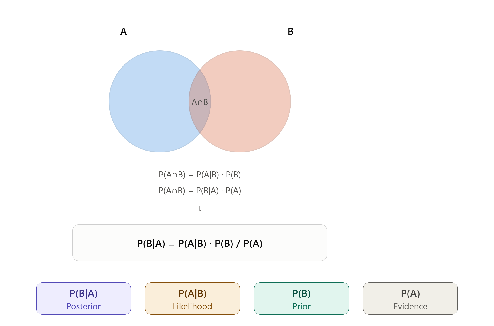
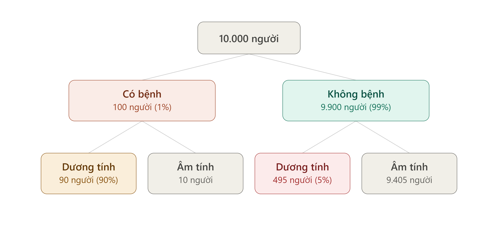

# Định lý Bayes

## Khái niệm

> Định lý Bayes là một công thức toán học quan trọng trong lý thuyết xác suất, cho phép chúng ta cập nhật xác suất của một giả thuyết khi có thêm bằng chứng hoặc dữ liệu mới.

$$ P(B|A) = \frac{P(A|B)P(B)}{P(A)} $$

trong đó:
- P(A): tỉ lệ phần tử của A trong $\Omega$.
- P(B): tỉ lệ phần tử của B trong $\Omega$.

> **Bài toán**: Một bệnh hiếm gặp ở 1% dân số. Có một xét nghiệm với độ chính xác như sau: nếu người bệnh làm xét nghiệm, 90% sẽ ra dương tính (đúng); nếu người khỏe mạnh làm xét nghiệm, 5% bị dương tính giả (sai). Một người xét nghiệm ra dương tính. Vậy xác suất họ thực sự mắc bệnh là bao nhiêu, biết tổng số dân là 10.000?

<figure>
  
  <figcaption>Minh họa bài toán</figcaption>
</figure>

Ta có: A: dương tính, B: mắc bệnh.
- P(B) = 0.01 (xác suất mắc bệnh).
- P(A|B) = 0.9 (xác suất người mắc bệnh xét nghiệm ra dương tính)
- P(A): xác suất xét nghiệm ra dương tính:

$$ P(A) = \frac{Số người được xét nghiệm dương tính}{Tổng số người tham gia xét nghiệm} = \frac{90 + 495}{10.000} = 0.0585$$

Vậy xác suất người xét nghiệm dương tính thực sự mắc bệnh là:

$$ P(B|A) = \frac{0.9 \times 0.01}{0.0585} = 0.154$$

Nghĩa là trong 90 + 495 = 585 người có kết quả xét nghiệm dương tính, chỉ có 15.4% = 90 người thực sự mắc bệnh.

## Công thức tổng quát

$$P(H) = \sum_{i=1}^{n} P(A_i) \cdot P(H|A_i)$$

trong đó P(H) là xác suất của H sau khi quan sát A.

Ấp dụng vào bài toán trên, ta có:
- H: dương tính thật.
- A: dương tính.

Có 90 trường hợp dương tính thật trong tổng số 585 xét nghiệm dương tính nên P(H|A) = 0.154.

