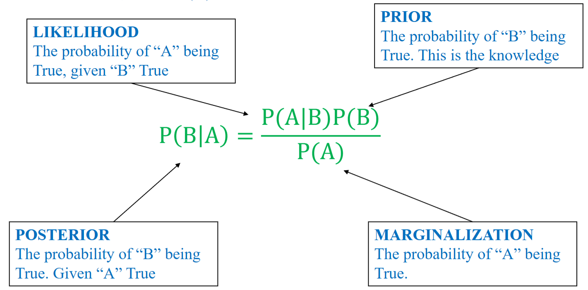

# Định lý Bayes

## Khái niệm

> Định lý Bayes là một công thức toán học quan trọng trong lý thuyết xác suất, cho phép chúng ta cập nhật xác suất của một giả thuyết khi có thêm bằng chứng hoặc dữ liệu mới.

$$ P(B|A) = \frac{P(A|B)P(B)}{P(A)} $$

trong đó:
- P(B): Xác suất tiên nghiệm của sự kiện B. Đây là niềm tin ban đầu về B trước khi biết bất kỳ thông tin gì về A.
- P(A): Xác suất biên của bằng chứng A. Đây là tổng xác suất để A xảy ra trong mọi trường hợp.
- P(A|B): Xác suất quan sát được bằng chứng A, nếu như sự kiện B là đúng.
- P(B|A): Xác suất hậu nghiệm của sự kiện B, sau khi đã biết bằng chứng A xảy ra (niềm tin đã được cập nhật).

### Các thành phần trong công thức Bayes

- Posterior (P(B|A)): xác suất B đúng khi biết A đúng.
- Likelihood (P(A|B)): xác suất A đúng khi biết B đúng.
- Prior (P(B)): xác suất B đúng (điều đã biết).
- Marginalization (P(A)): xác suất A đúng.

**Bài toán**: Một bệnh hiếm gặp ở 1% dân số. Có một xét nghiệm với độ chính xác như sau: nếu người bệnh làm xét nghiệm, 90% sẽ ra dương tính (đúng); nếu người khỏe mạnh làm xét nghiệm, 5% bị dương tính giả (sai). Một người xét nghiệm ra dương tính. Vậy xác suất họ thực sự mắc bệnh là bao nhiêu, biết tổng số dân là 10.000?

<figure>
  
  <figcaption>Minh họa bài toán</figcaption>
</figure>

Ta có: A: dương tính, B: mắc bệnh.
- P(B) = 0.01 (xác suất mắc bệnh).
- P(A|B) = 0.9 (xác suất người mắc bệnh xét nghiệm ra dương tính)
- P(A): xác suất xét nghiệm ra dương tính:

$$ P(A) = \frac{Số người được xét nghiệm dương tính}{Tổng số người tham gia xét nghiệm} = \frac{90 + 495}{10.000} = 0.0585$$

Vậy xác suất người xét nghiệm dương tính thực sự mắc bệnh là:

$$ P(B|A) = \frac{0.9 \times 0.01}{0.0585} = 0.154$$

Nghĩa là trong 90 + 495 = 585 người có kết quả xét nghiệm dương tính, chỉ có 15.4% = 90 người thực sự mắc bệnh.

## Định lý xác suất toàn phần

Sử dụng định lý này khi biết xác suất của từng nguyên nhân Aᵢ và xác suất của hệ quả H xảy ra với mỗi nguyên nhân, từ đó tính ra xác suất tổng thể của H:

$$P(H) = \sum_{i=1}^{n} P(A_i) \cdot P(H|A_i)$$

trong đó P(H) chính là Marginalization trong định lý Bayes (điều kiện là $A_1, A_2,..., A_n$ phải là một hệ đầy đủ các biến cố, tức chúng đôi một không giao nhau và hợp lại lấp đầy toàn bộ không gian mẫu $\Omega$). Như vậy, định lý xác suất toàn phần thường được dùng làm một bước tính toán bên trong Bayes.

Ấp dụng vào bài toán trên, ta có:

$$ P(H) = 0.01.0.9 + 0.99.0.05 = 0.0585 $$

## Định lý Bayes trong phân phối ngẫu nhiên liên tục

- **Phân tích**: với biến ngẫu nhiên liên tục, ta không thể đếm các giá trị riêng lẻ như biến ngẫu nhiên rời rạc. Vì vậy ta giả định rằng biến liên tục đó tuân theo phân phối xác suất Gaussian trong mỗi lớp. 

**Bài toán**: Cho bảng dữ liệu đặc tính chiều dài của cánh hoa:

| Length | Category |
| --- | --- | 
| 1.4 | 0 |
| 1 | 0 |
| 1.3 | 0 |
| 1.9 | 0 |
| 2 | 0 |
| 3.8 | 1 |
| 4.1 | 1 |
| 3.9 | 1 |
| 4.2 | 1 |
| 3.4 | 1 |

Vậy một hoa có chiều dài cánh 3.0 thì thuộc category nào?

**Bước 1**: Tính trung bình cộng và phương sai của mỗi lớp:

- Category 0: 
$$ \mu_0 = \frac{1.4 + 1 + 1.3 + 1.9 + 2}{5} = 1.52$$
$$ \sigma^2_0 = \frac{(1.4-1.52)^2 + (1-1.52)^2+(1.3-1.52)^2+(1.9-1.52)^2+(2-1.52)^2}{5} = 0.1416 $$
=> $ \sigma_0 = \sqrt{0.1416} = 0.3763 $

- Category 1:
$$ \mu_1 = \frac{3.8+4.1+3.9+4.2+3.4}{5} = 3.88$$
$$ \sigma^2_1 = \frac{(3.8-3.88)^2 + (4.1-3.88)^2+(3.9-3.88)^2+(4.2-3.88)^2+(3.4-3.88)^2}{5} = 0.0776 $$
=> $ \sigma_1 = \sqrt{0.0776} = 0.2786 $

**Bước 2**: Thay $ \mu, \sigma $ vào hàm Gauss và tính hàm mật độ xác suất của mỗi biến:

$$ f(len|Cat=0) = (\frac{1}{\sigma_0.\sqrt{2\pi}}).e^{\frac{-(x-\mu_0)^2}{2\sigma_0^2}} = \frac{1}{0.3763\sqrt{2\pi}}.e^{\frac{-(x-1.52)^2}{2.0.1416}} $$

$$ f(len|Cat=1) = (\frac{1}{\sigma_1.\sqrt{2\pi}}).e^{\frac{-(x-\mu_1)^2}{2\sigma_1^2}} = \frac{1}{0.2786\sqrt{2\pi}}.e^{\frac{-(x-3.88)^2}{2.0.0776}} $$

| Length | PDF(Length) | Category |
| :---: | :---: | :---: |
| 1.4 | 1.007 | 0 |
| 1 | 0.408 | 0 |
| 1.3 | 0.893 | 0 |
| 1.9 | 0.636 | 0 |
| 2 | 0.469 | 0 |
| 3.8 | 1.374 | 1 |
| 4.1 | 1.048 | 1 |
| 3.9 | 1.428 | 1 |
| 4.2 | 0.74 | 1 |
| 3.4 | 0.324 | 1 |

**Bước 3**: Tính toán các thành phần:

- Tính likelihood bằng cách thay length=3.0 vào 2 hàm ở bước 2:

$$ f(len|Cat=0) = \frac{1}{0.3763\sqrt{2\pi}}.e^{\frac{-(3-1.52)^2}{2.0.1416}} = 0.0004638 $$

$$ f(len|Cat=1) = \frac{1}{0.2786\sqrt{2\pi}}.e^{\frac{-(3-3.88)^2}{2.0.0776}} = 	0.0097495 $$

- Tính prior (P(Cat)):

Trong bảng dữ liệu ban đầu có 5 mẫu thuộc lớp 0 và 5 mẫu thuộc lớp 1 nên:

$$ p(Cat=0) = p(Cat=1) = \frac{5}{10} = 0.5 $$

- Tính Marginalization (P(Len)) áp dụng định lý xác suất toàn phần:

$$p(\text{Len} = 3.0) = \underbrace{p(\text{Len} = 3.0 \mid \text{Cat} = 0) \cdot p(\text{Cat} = 0)}_{\text{tử số của công thức lớp 0}} + \underbrace{p(\text{Len} = 3.0 \mid \text{Cat} = 1) \cdot p(\text{Cat} = 1)}_{\text{tử số của công thức lớp 1}}$$

Thế số:

$$p(\text{Len} = 3.0) = (0.0004638 \times 0.5) + (0.0097495 \times 0.5) = 0.0002319 + 0.0048748 = 0.005107$$

Đây là lý do hai công thức Bayes ở cuối trang **dùng chung một mẫu số** — mẫu số đó chính là tổng của hai tử số, không phải tính riêng.

- Tính ra posterior:

$$p(\text{Cat} = 0 \mid \text{Len} = 3.0) = \frac{0.0002319}{0.005107} = 0.0454$$

$$p(\text{Cat} = 1 \mid \text{Len} = 3.0) = \frac{0.0048748}{0.005107} = 0.9546$$

Tức là mẫu length = 3.0 phân vào lớp 0 có độ tin cậy là 4,54%, vào lớp 1 có độ tin cậy là 95,46%. Như vậy nó có khả năng thuộc về category 1 nhiều hơn.
