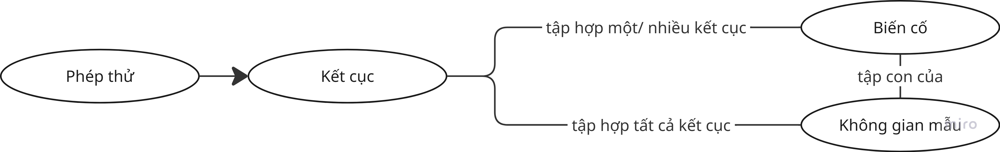

# Xác suất cơ bản

## Xác suất và những khái niệm xoay quanh xác suất

- Xác suất mô tả sự không chắc chắn (uncertainty). Khi đặt một câu hỏi xác suất, ta luôn hỏi 3 điều:

  - Những kết quả nào có thể xảy ra?

  - Mỗi kết quả có khả năng xảy ra bao nhiêu?
  
  - Xác suất của một *biến cố* là bao nhiêu?

- Ví dụ:

  - Xác suất tung đồng xu ra mặt ngửa.

  - Xác suất gieo xúc xắc ra số chẵn.

  - Xác suất một dòng dữ liệu lấy ngẫu nhiên thuộc lớp A → đây chính là dạng bài toán của Machine Learning.

- Ký hiệu: P(A).
- Đặc điểm: 0 <= P(A) <= 1.

### Các khái niệm cốt lõi

| Khái niệm | Ý nghĩa | Ví dụ | Ký hiệu
| --- | --- | --- | --- |
| Phép thử (Experiment) | Một hành động được thực hiện mà không thể biết trước chắc chắn kết quả, nhưng có thể xác định được tập hợp tất cả các kết quả có thể xảy ra. | Tung một xúc xắc | E 
| Không gian mẫu (Sample Space) | Tập hợp tất cả các kết cục có thể xảy ra của một phép thử. | Ra mặt {1, 2, 3,... 6} chấm | Ω (Omega)/ S.
| Kết cục (Outcome) | Một kết quả đơn lẻ, cụ thể của phép thử - là một phần tử của không gian mẫu. Còn gọi là biến cố sơ cấp (elementary event). | Xuất hiện mặt 4 chấm. | ω (omega thường), hoặc kᵢ. Ta viết ω ∈ Ω.
| Biến cố / Sự kiện (Event) | Một tập hợp con của không gian mẫu, gồm một hoặc nhiều kết cục thỏa mãn một điều kiện nào đó. | A = "xuất hiện mặt chẵn" → A = {2, 4, 6} ⊂ Ω. | Chữ viết hoa (A, B, C,...)

### Biến ngẫu nhiên

**Định nghĩa:** Biến ngẫu nhiên là một *ánh xạ* gán một **giá trị số** cho mỗi kết quả của phép thử ngẫu nhiên.

Ví dụ với xúc xắc:
- Phép thử: gieo xúc xắc cân đối
- Kết quả: ω = "mặt 4 xuất hiện"
- Biến ngẫu nhiên: X(ω) = 4
- Tập giá trị: X ∈ {1, 2, 3, 4, 5, 6}

| | **Rời rạc (Discrete)** | **Liên tục (Continuous)** |
|---|---|---|
| Tập giá trị | Đếm được | Một khoảng liên tục |
| Ví dụ | Kết quả xúc xắc, số email spam | Chiều dài cánh hoa (petal length) |
| Ký hiệu | X ∈ {1,…,6} | X ∈ ℝ |

```
Rời rạc:   ●───●───●───●───●───●
           1   2   3   4   5   6

Liên tục:  ├──●─────┼───────┼──●──┼──●┤
           1  1.4   2       3  3.8 4  4.9
```

### Biến cố

Có 5 loại biến cố:

- Biến cố chắc chắn (tập vũ trụ - U): luôn xảy ra, bằng cả không gian mẫu.

- Biến cố không thể (tập rỗng - V): không bao giờ xảy ra.

- Biến cố đối lập: biến cố "không xảy ra A".

- Biến cố xung khắc: 2 biến cố không thể đồng thời xảy ra, tức AB = V.

- Biến cố ngẫu nhiên: có thể xảy ra hoặc không.



> Không gian mẫu >= Biến cố >= Kết cục.

## Phép toán trong xác suất

- Tổng 2 sự kiện: A + B => sự kiện xuất hiện ít nhất trong một trong hai sự kiện trên ($A \cap B$).
- Tích 2 sự kiện: A.B => sự kiện xuất hiện đồng thời cả hai sự kiện trên ($A \cup B$).
- Đối lập của sự kiện A là $\overline{A}$ => sự kiện không xuất hiện A.
- Xung khắc: hai sự kiện A và B xung khắc khi chúng không thể đồng thời xảy ra, tức AB = V.
- Kéo theo: sự kiện A dẫn tới sự kiện B (A=>B).
- Tương đương: nếu xuất hiện A thì xuất hiện B và ngược lại (A=B).
- Hiệu 2 sự kiện: A - B => sự kiện xuất hiện ở A nhưng không xuất hiện ở B (A\B).


## Phân loại xác suất

- Xác suất cổ điển (Classical Probability): P(A) = số kết quả thuận lợi / tổng số kết quả có thể.

- Xác suất hình học (Geometric Probability): dùng khi biến liên tục, tính theo tỉ lệ "độ đo miền".

Khi biến ngẫu nhiên là liên tục, tức có khả năng nhận vô số giá trị trong một khoảng nào đó, ta không thể đếm được số kết cục nữa => chuyển sang "đo". 


Giả sử trong hình trên, ta muốn tính xác suất một điểm trong hình chữ nhật ABCD thuộc tam giác con, thì sẽ lấy diện tích tam giác chia cho diện tích chữ nhật. 

- Xác suất thực nghiệm (Empirical Probability): dựa trên số lần xảy ra thực tế/ tổng số lần thử. 

## Giải tích kết hợp

- Chọn ngẫu nhiên k phần tử từ n phần tử cho trước:

  - Sắp xếp theo thứ tự => **chỉnh hợp**:

    - k phần tử khác nhau:

    $$ A^k_n = \frac{n!}{(n-k)!}$$

    - k phần tử có thể lặp lại => **chỉnh hợp lặp**:

  $$ A^k_n = n^k$$

  - Không phân biệt thứ tự => **tổ hợp**:

  $$ C^k_n = \frac{A^k_n}{k!} =\frac{n!}{k!(n-k)!}$$

- Sắp xếp n phần tử theo các cách khác nhau => **hoán vị**:

$$ P_n = n!$$