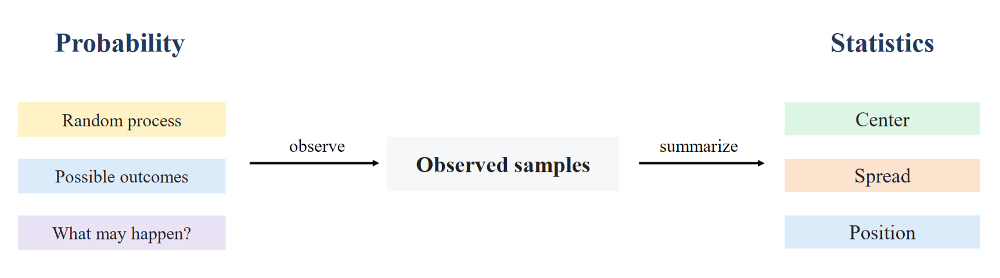
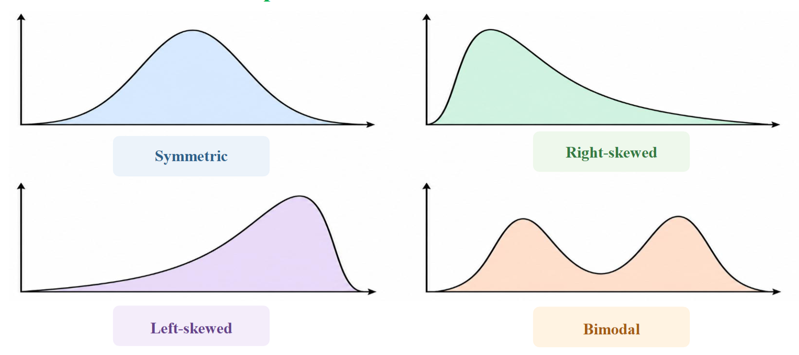
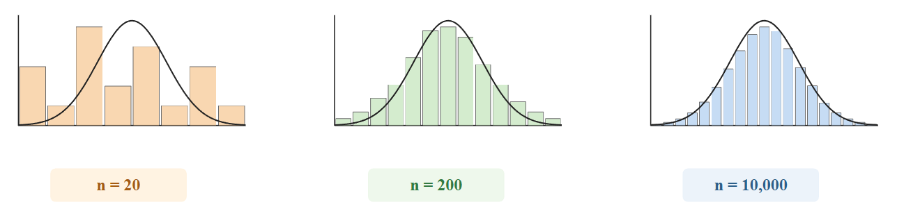

# Thống kê cơ bản

## Các khái niệm cơ bản

### Mối liên quan giữa xác suất và thống kê:

- **Xác suất**: đi từ mô hình → dự đoán dữ liệu.
    
- **Thống kê**: đi từ dữ liệu → suy luận về mô hình.



> Thống kê biến quan sát thô thành thông tin có thể diễn giải được.

### Tổng thể và mẫu

| | Định nghĩa | Ví dụ Iris |
|---|---|---|
| **Population** | Toàn bộ tập đối tượng/quan sát mà ta quan tâm | Tất cả hoa Iris trên thực tế |
| **Sample** | Tập con của tổng thể mà ta **thực sự quan sát được** | 150 bông hoa trong dataset |

=> Population ⊃ Sample

## Mô tả dữ liệu

Ba câu hỏi khi mô tả dữ liệu

| Câu hỏi | Đại lượng |
|---|---|
| 1. Trung tâm ở đâu? | **Mean** (trung bình), **Median** (trung vị) |
| 2. Dữ liệu phân tán ra sao? | **Variance** (phương sai), **Standard deviation** (độ lệch chuẩn) |
| 3. Một giá trị nằm ở đâu so với phần còn lại? | **Percentile**, **Quantile** |

### Xu hướng tập trung (Central Tendency)

Các đại lượng này mô tả điểm trung tâm hoặc giá trị đại diện cho toàn bộ tập dữ liệu.

#### Kỳ vọng/ giá trị trung bình (Mean)

* **Khái niệm**: Tổng tất cả các giá trị chia cho tổng số lượng phần tử.

* **Công thức**:
  $$\mu = \frac{1}{N}\sum_{i=1}^{N} x_i$$
* **Đặc điểm**: Nhạy cảm với giá trị ngoại lệ (outliers).

#### Trung vị (Median)
* **Khái niệm**: Giá trị nằm ở chính giữa khi dãy số đã được sắp xếp theo thứ tự tăng/giảm.

* **Đặc điểm**: Ít bị ảnh hưởng bởi outlier.

**Lưu ý**: Nếu `mean` và `median` lệch nhau nhiều → dữ liệu **lệch (skewed)** hoặc **có outlier**.

#### Yếu vị (Mode)

* **Khái niệm**: Giá trị có tần suất xuất hiện nhiều nhất trong tập dữ liệu.

```python
import numpy as np
from scipy import stats

data = np.array([1, 2, 2, 3, 4, 100])  # 100 là ngoại lệ (outlier)

mean_val = np.mean(data)            # Kết quả: 18.67
median_val = np.median(data)        # Kết quả: 2.5
mode_val = stats.mode(data).mode    # Kết quả: 2
```

### Độ phân tán dữ liệu (Dispersion)

Đo lường mức độ biến động hoặc sự lan rộng của các điểm dữ liệu xung quanh giá trị trung bình.

#### Phương sai (Variance): 

- Khái niệm: Bình phương độ chênh lệch trung bình giữa từng phần tử và giá trị trung bình.

| | **Phương sai tổng thể** | **Phương sai mẫu** |
|---|---|---|
| | Mô tả dữ liệu quan sát được | Ước lượng cho tổng thể lớn hơn |
| Code | `np.var(x, ddof=0)` / `np.std(x, ddof=0)` | `np.var(x, ddof=1)` / `np.std(x, ddof=1)` |
| Công thức | $ \sigma^2 = \frac{\sum(x_i - \mu)^2}{N} $ | $ s^2 = \frac{\sum(x_i - x)^2}{N-1} $ |
| Tên gọi | Population variance | Sample variance (hiệu chỉnh Bessel) |

#### Độ lệch chuẩn (Standard Deviation): 

- Khái niệm: Căn bậc hai của phương sai, đưa đại lượng về cùng đơn vị đo với dữ liệu gốc.
    
$$\sigma = \sqrt{Var(X)}$$
    
```python
# Phương sai và độ lệch chuẩn của quần thể (ddof=0)
var_pop = np.var(data)
std_pop = np.std(data)

# Phương sai và độ lệch chuẩn của mẫu (ddof=1 - Hiệu chỉnh Bessel)
var_sample = np.var(data, ddof=1)
std_sample = np.std(data, ddof=1)
```

### Vị trí của dữ liệu (Percentile và Quantile)

**Định nghĩa:** *Percentile thứ p* là giá trị mà khoảng **p%** số quan sát nằm ở dưới nó.

```python
x = np.array([1.0, 2.2, 3.0, 4.6, 5.8, 6.6, 8.0])

percentiles = np.percentile(x, [25, 50, 75])
quantiles   = np.quantile(x, [0.25, 0.50, 0.75])

print("Percentiles:", percentiles)
print("Quantiles:", quantiles)
# Percentiles: [2.6 4.6 6.2]
# Quantiles:   [2.6 4.6 6.2]
```

```
Q1 (25%) = 2.6      Q2 (50%) = 4.6     Q3 (75%) = 6.2
      │                    │                 │
├──●──┼●──●───●────┼───●───┼──●───●──┼──●───┼─●────●──┤
0           2           4           6           8      10
```

Diễn giải: *Percentile 75 = 6.2 cm ⇒ khoảng 75% quan sát có giá trị ≤ 6.2 cm.*

| Ký hiệu | Tên | Ý nghĩa |
|---|---|---|
| Q1 | Percentile 25 | 25% dữ liệu nằm dưới |
| Q2 | Percentile 50 | = **Median** |
| Q3 | Percentile 75 | 75% dữ liệu nằm dưới |

- `percentile` nhận thang **0–100**, `quantile` nhận thang **0–1** → cho kết quả **giống nhau**.

- **IQR (Interquartile Range) = Q3 − Q1** → thước đo độ phân tán bền vững với outlier.

```python
q1, q3 = np.percentile(x, [25, 75])
iqr = q3 - q1
lower, upper = q1 - 1.5 * iqr, q3 + 1.5 * iqr     # quy tắc phát hiện outlier
print(iqr, lower, upper)
```

## Phân phối dữ liệu

### Các dạng phân phối thường gặp (Common Distribution Shapes)



| Hình dạng | Đặc điểm | Gợi ý |
|---|---|---|
| **Symmetric** (đối xứng) | Cân đối hai bên đỉnh | mean ≈ median |
| **Right-skewed** (lệch phải) | Đuôi dài về bên phải | mean > median (thu nhập, thời gian chờ) |
| **Left-skewed** (lệch trái) | Đuôi dài về bên trái | mean < median |
| **Bimodal** (hai đỉnh) | Hai vùng tập trung | Có thể do **trộn nhiều nhóm con** (nhiều lớp) |

> *Hình dạng phân phối có thể cho thấy độ lệch, sự tồn tại của nhóm con, hoặc cấu trúc bất thường.*

### Phân phối Gaussian (phân phối chuẩn)

$$X \sim \mathcal{N}(\mu, \sigma^2)$$

$$f(x) = \frac{1}{\sigma\sqrt{2\pi}}e^{-\frac{1}{2}\left(\frac{x-\mu}{\sigma}\right)^2}$$

**Tính chất:**
- Đối xứng quanh mean
- Mật độ cao nhất gần trung tâm
- Giá trị ở xa ít gặp hơn
- Được mô tả hoàn toàn bởi **μ** và **σ**

| Tham số | Vai trò |
|---|---|
| **μ** | Điều khiển **vị trí** (location) |
| **σ** | Điều khiển **độ rộng** (spread) |


### Histogram

Histogram thể hiện phân bố dữ liệu bằng cách chia khoảng giá trị thành các bins. Việc lựa chọn số lượng bins ảnh hưởng trực tiếp đến khả năng quan sát phân phối:

-   **Quá ít bins (Coarse)**: Mất thông tin chi tiết của phân phối.
    
-   **Quá nhiều bins (Noisy)**: Biểu đồ bị nhiễu, khó thấy xu hướng tổng thể.
    
-   **Cân bằng (Balanced)**: Phản ánh trung thực dạng phân phối.


    
```python
counts, bin_edges = np.histogram(x, bins=15)
```


## Quan hệ dữ liệu

Để mô tả mối quan hệ tuyến tính giữa hai biến ngẫu nhiên X và Y, ta có các chỉ số:

#### Hiệp phương sai (Covariance)

- **Khái niệm**: Cho biết hướng biến thiên cùng chiều hay ngược chiều của X và Y.
    
- **Công thức**:
    
$$Cov(X, Y) = \frac{1}{N}\sum_{i=1}^{N}(x_i - \bar{x})(y_i - \bar{y})$$
    
| Giá trị | Ý nghĩa |
|---|---|
| **Cov > 0** | Quan hệ đồng biến |
| **Cov < 0** | Quan hệ nghịch biến |
| **Cov ≈ 0** | Không có quan hệ tuyến tính rõ ràng |
        
- Vấn đề về thang đo của covariance

$$X_{cm} = 100 \cdot X_m \quad \Rightarrow \quad Cov(X_{cm}, Y) = 100 \cdot Cov(X_m, Y)$$

| Chiều cao tính bằng mét | Chiều cao tính bằng centimet |
|---|---|
| Hình dạng scatter **giống hệt nhau** | Giá trị covariance **khác nhau 100 lần** |

⚠️ Đổi đơn vị làm thay đổi độ lớn của covariance, dù mẫu hình không hề thay đổi ⇒ Không thể dùng độ lớn covariance để so sánh các cặp đặc trưng khác đơn vị. 

=> Cần một đại lượng *không đơn vị* → **Correlation**.

#### Hệ số tương quan (Correlation Coefficient)

- **Định nghĩa:** Hệ số tương quan chuẩn hóa hiệp phương sai bằng độ lệch chuẩn của cả hai biến.

$$r_{XY} = \frac{Cov(X, Y)}{\sigma_X \sigma_Y}, \qquad -1 \le r_{XY} \le 1$$

=> Chuẩn hóa hiệp phương sai về khoảng \[−1,1\] để đo độ mạnh và hướng của mối quan hệ tuyến tính.
    
- **Ý nghĩa**:
    
    -   r\=1: Tương quan thuận tuyệt đối.
        
    -   r\=−1: Tương quan nghịch tuyệt đối.
        
    -   r\=0: Không có tương quan tuyến tính.
        

```python
x = np.array([1, 2, 3, 4, 5])
y = np.array([2, 4, 6, 8, 10])

# Tính ma trận hiệp phương sai
cov_matrix = np.cov(x, y)

# Tính ma trận hệ số tương quan
corr_matrix = np.corrcoef(x, y)
r_xy = corr_matrix[0, 1]  # Output: 1.0
```

> Tương quan không phải là nhân quả (correlation ≠ causation).


    
